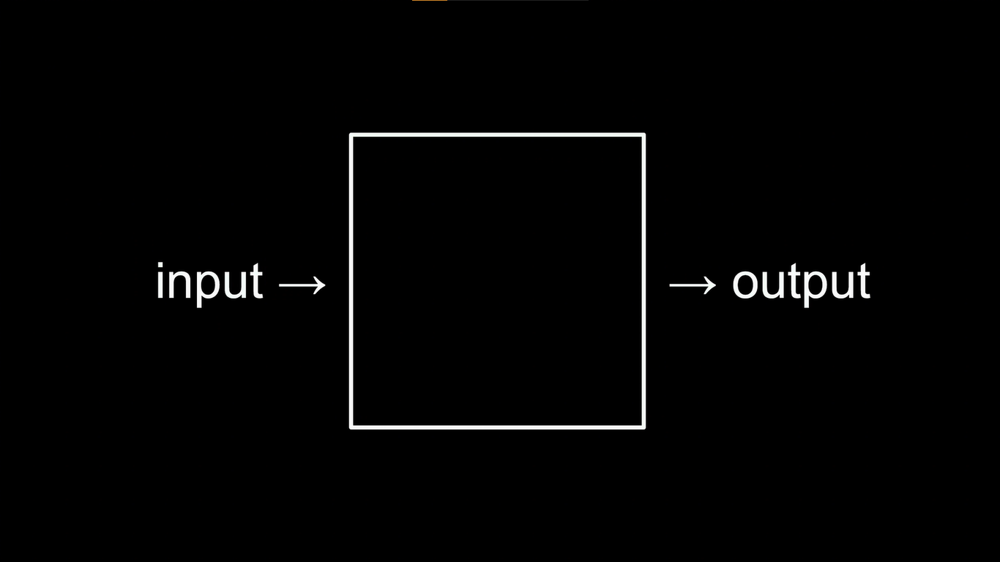
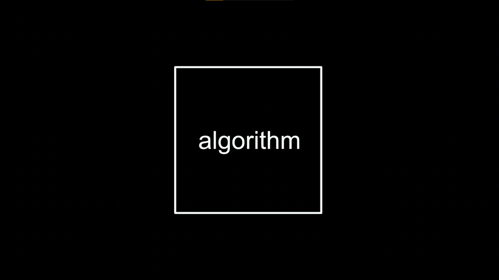

# CS50 Week 0 - Scratch

Problem solving start with an **input** and ends with an **output**, so what happens between both is what the developer had to create to solve the given problem.



An example problem could be:
- To take attendance in the beggining of the class

#### Unary
We could use a _system_ called **unary** to count every student in the class - we can compare it as a fancy way of counting like 1, 2, 3, 4, 5...
With it we can use a single symbol to solve a problem, like counting the number of people in the room. It can also be called **base-1**, and might be not used very often.

#### Binary
Computers most often use the **binary** system, that can just have one or another value, _true_ or _false_. It's name origin is from _binary digit_, we could have an analogy for it's origin after removing some letters of it like this:
```
binary digit
bi         t
bit
```
It's also know as **base-2**.

---

Both systems relate to one that we are already very used to that is the **base-10** system, a.k.a. **decimal**. If we rewind to our primary school and see how decimals work we can also see that's very similar that we do with unary and binary:

Lets consider the number 123: 

```
   Decimal

    10²      10¹     10⁰  # They could be represented by powers, here the 'base' term makes sense
    100       10       1  # These are the places: hundreds, tens and units respectively
      1        2       3
100 x 1 + 10 x 2 + 1 x 3  =  123

--------------------------------

   Binary
   
...  2²   2¹   2⁰  # And so forth...
      4    2    1
      1    1    1
      4 +  2 +  1  = 7
```
With this example it is possible to see that it's easier to count in computer's way using binaries than decimals.

# Bytes representation

A bit alone is not such useful so the most used unit to represent them is the **byte**, that is a combination of eight bits, and it can hold a maximum number of 256 digits (from 0 to 255).

And this _byte_ unit is used to represent everything in computing, for example, the letters that we write everywhere in messages, or that you're seeing now: they're represented by bytes for the computer, using a standard named ASCII (_American Standard Code for Information Interchange_), give it a look

## Bytes in characters


In it we can see each (at least most) character of our keyboard represented by bytes.

So, when we're sending a message for somebody in a messaging app, the computer reads this:

```
72 73 33
 H  I  !
```

But as you can assume, it can't represent every letter that we know, as it was designed by americans it doesn't have accents like the Portuguese language has or many different characters that many asian languages have.

So for this they created the [Unicode Standard](https://en.wikipedia.org/wiki/Unicode), that's a universal standard for all characters, even for emojis.

## Bytes in colors
But as we said, they can represent everything in computing, even colors.

The colors in the digital world can be represented by the RGB color model, that are sums of the primary colors Red, Green and Blue, and when they're summed up they can turn into a **pixel**.

Each primary color can go from 0 to 255 (the size of a byte), where 0 is the ausence of the color, total black, and 255 is the complete color, or white.

For example, if we wanted a light green color, we could represent it with RGB like this:
```
R   G   B
41  255 198
```
And it would be like this:


So a pixel is composed by three bytes, and a bitmap image is composed by an enormous quantity of pixels that can be seemed when we zoom in like in this 😂 emoji:


Having this in mind, we can interpret videos and movies as pixels that are changing values constantly, or being more exactly, a sequence of frames (images) being displayed one by one in a fast sequence, from this comes the term **FPS** (frames per second), that generally can be 60 or 30 for displays, and 24 for movies.

This term is more near to us when something freezes in our screens, like when using a phone and it hangs for some unknown reason but still responsive to our touch - after all what happened was that the frames dropped to 0 and things were still being processed behind the scenes.

---
So, we could say that every different extension that we see in our files, like .mp3, .mp4, .ppt, .doc, .pdf, are different ways to represent zeroes and ones in computing.

# Abstraction

Abstraction is a term very used in computer science that refers to the simplification of something, so we can focus on the higher level goals and not in the lower level goals.

For example, when we have a car to use it everyday we don't need to know how its engine works to simply drive it from place A to place B.

We can apply it to computer science with the same idea. We don't need to know how the code works sometimes, but focus on attending the main problem. And we can call this abstraction as algorithm. 



Now looking at the first image, we could say that what gives the output is the abstraction, that the user doesn't know it works, and there's no problem with that.

# Pseudocode

So lets write an actual code (algorithm) to solve some problem. 

A good practice to solve problems however is not writing directly in a final programming language like Python, Java or C, but rather in **pseudocode**, that is a lot like any human spoken language, to jot down their ideas.

For example, let's solve the problem for *searching someone else's phone number in a phone book*.

The first thing we need to do is to grab the book.

```
1  Grab the phone book
```

Then we could open in the middle of the book, where would be the most probable to find it.

```
2  Open to middle of phone book
```

And then, obviously, look at the page for the phone number

```
3  Look at page
```

Now lets group altogether

```
1  Grab the phone book
2  Open to middle of phone book
3  Look at page
```
So following this order we can think programmaticaly in what we need to do. Lets complete this code entirely.

```
1  Grab the phone book
2  Open to middle of phone book
3  Look at page
4  If person is on page
5      Call person
6  Else if person is earlier in book
7      Open to middle of left half of book
8      Go back to line 3
9  Else if person is later in book
10     Open to middle of right half of book
11     Go back to line 3
12 Else
13     Quit
```

In this piece of pseudocode, we could compare the verbs as functions and the 'ifs' and 'elses' as conditional blocks.


